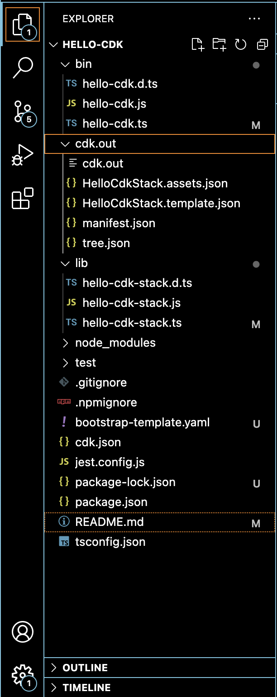
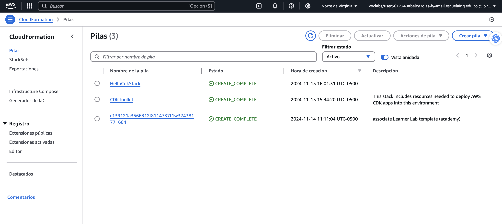
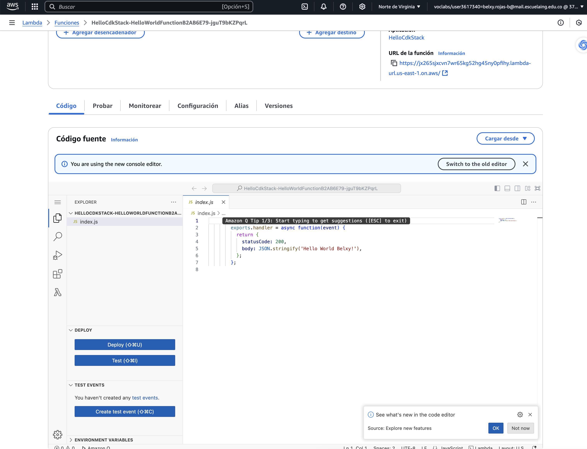
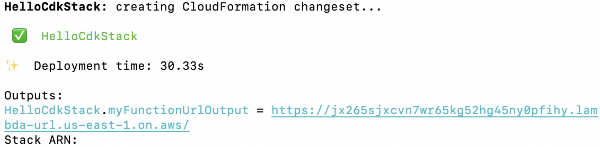
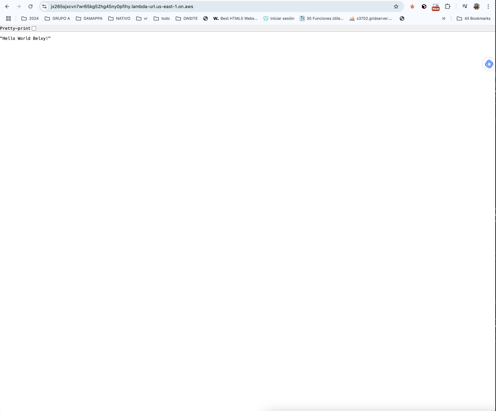

#  Creación de una Aplicación con AWS CDK

En este experimento, se utilizó AWS CDK para implementar una función Lambda con un endpoint HTTP accesible a través de un Lambda Function URL. Se documentaron los pasos clave, incluyendo la creación del proyecto, la configuración del entorno de AWS, la implementación de los recursos y la interacción con la aplicación

# Pasos Realizados
## Creación del Proyecto

### Se inicializó un nuevo proyecto con el comando:
mkdir hello-cdk && cd hello-cdk
cdk init app --language typescript

### Se especificaron la cuenta y la región de AWS en el archivo bin/hello-cdk.ts:
env: { account: '123456789012', region: 'us-east-1' },

### Se preparó el entorno de AWS con:
cdk bootstrap

### En lib/hello-cdk-stack.ts, se definió una función Lambda que devuelve el mensaje Hello World!.
Configuración de Lambda Function URL

### Se añadió un endpoint HTTP sin autenticación para la función Lambda:

const myFunctionUrl = myFunction.addFunctionUrl({
  authType: lambda.FunctionUrlAuthType.NONE,
});
new cdk.CfnOutput(this, "myFunctionUrlOutput", {
  value: myFunctionUrl.url,
});

###  Síntesis y Despliegue

cdk synth
cdk deploy

# Resultados
Implementación Exitosa: La función Lambda y su URL fueron creadas correctamente.
Prueba Inicial: La función devolvió el mensaje "Hello World Belxy!" como se esperaba.
Actualización Exitosa: Después de modificar la función, el mensaje se actualizó a "Hello CDK!".

# Capturas de Pantalla
## Estructura del Proyecto

## AWS

## Enlace de la pagina

## Prueba del Endpoint

Conclusiones
AWS CDK simplifica la creación y gestión de recursos en AWS mediante código. Este experimento demostró cómo desarrollar, desplegar y actualizar una aplicación básica utilizando TypeScript, mostrando la potencia y flexibilidad de esta herramienta la ruta donde se visualiza es https://jx265sjxcvn7wr65kg52hg45ny0pfihy.lambda-url.us-east-1.on.aws/.

